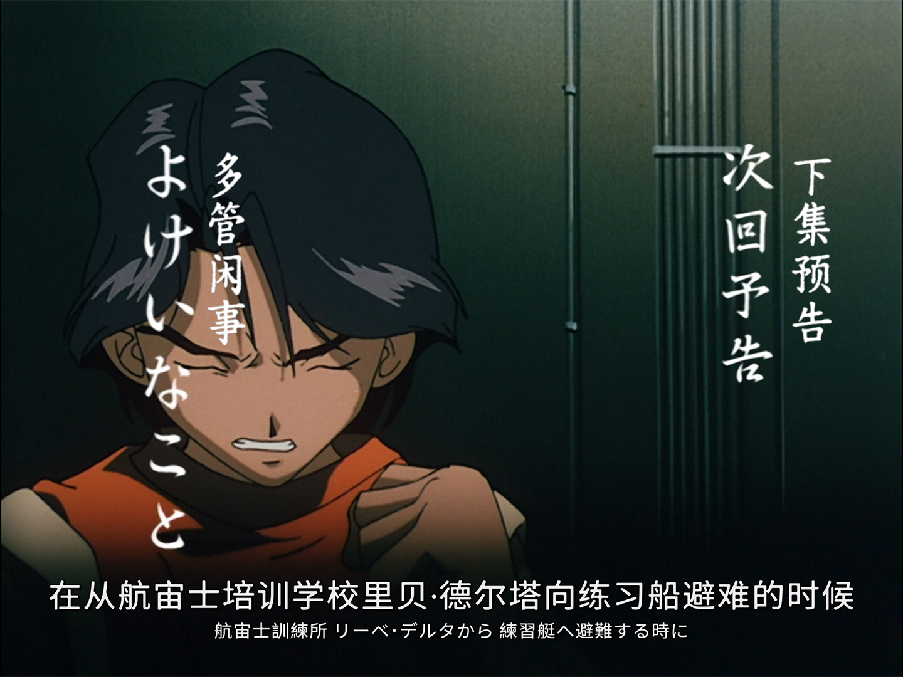

# 1440X1080 调轴适配

## 说明

番剧《无限的未知》中日双语字幕，调轴适配 1440x1080 版本

## 修改

重新调轴, 适配 **1440x1080** 的片源 ( ED在前, 预告在后 )

根据个人喜好做了部分美化

## 片源

[[1999-2000] Infinite Ryvius_無限的未知(無限のリヴァイアス)_TV / BDRip.MKV.1440x1080.RAW.U2](https://share.dmhy.org/topics/view/525495_20yrs_ago_-_1999-2000_Infinite_Ryvius_TV.html)

## 字体

[【975 朦胧黑体】](https://github.com/lxgw/975HazyGo)

[【寒蝉活楷体】](https://github.com/Warren2060/ChillMovableType)

**注意：** 寒蝉活楷体原作者版本安装后没有竖排版格式（``.``或``@``开头）, 所以我重新打包了一下, 支持竖排版格式. 如果你正在使用原作者的字体版本, 可能竖排文本的字体格式无法生效, 建议安装我给的字体.

## 截图

## 源项目 | 字幕来源

[**xzczd/InfiniteRyvius**](https://github.com/xzczd/InfiniteRyvius)
